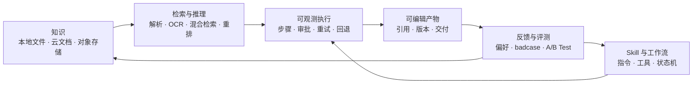

# LazyMind

**[English](README.md)** | **中文**

> **让 AI 按照你的资料、标准和偏好，稳定完成真实任务。**

[](https://github.com/LazyAGI/LazyMind/stargazers)
[](LICENSE)
[](desktop/README.md)
[](desktop/README.md)
[](docs/quick_start.CN.md)

LazyMind 是面向知识密集型工作的 **AI Skill Runtime**。它在同一个工作台里连接可复用知识、可执行 Skill、可观测工作流、可编辑产物与评测驱动的持续改进。

你不必反复上传资料、调 Prompt 或全程盯着 Agent：选择一次知识与工作流，LazyMind 会继续规划、执行、展示中间结果，并把经过确认的反馈带到下一次任务中。既可以通过 **Desktop Mode** 在本机使用，也可以部署为团队共享的企业服务。

**[快速开始](#快速开始)** · **[产品架构](docs/architecture.md)** · **[构建工作流](docs/workflow-format.md)** · **[桌面模式](desktop/README.md)**

---

## 它能交付什么？

| 场景 | LazyMind 执行 | 你获得 |
|------|---------------|--------|
| **调研与评审** | 搜索资料 → 检索证据 → 对比 → 综合 → 审阅 | 基于内部资料与外部来源、过程可追溯的报告 |
| **AI Writer** | 整理素材 → 生成大纲 → 分章节写作 → 修改 → 终审 | 可编辑、有版本记录的文档，而不是一次性回答 |
| **AI Image** | 理解需求 → 收集参考 → 优化 Prompt → 生成/编辑 | 保留生成过程的图片与动态表情 |
| **知识助手** | 接入资料 → 解析/OCR → 混合检索 → 重排 → 回答 | 可回溯到组织知识的答案 |
| **质量改进** | 收集 badcase → 评测 → 诊断 → A/B Test → 部署 | 经过验证的策略优化，而不是未经检查的 Prompt 改动 |

## LazyMind 如何工作



这个闭环由三个相互连接的系统组成：

| 系统 | 负责什么 | 产品行为 |
|------|----------|----------|
| **知识底座** | 给 AI 正确的上下文 | 多源接入、OCR、混合检索、重排与原文追溯 |
| **状态大脑** | 让长任务不跑偏 | 步骤可见、关键点审批、产物可编辑、重试/回退与版本记录 |
| **AI 成长引擎** | 安全地改进下一次执行 | 可审核的偏好与术语，以及评测、诊断、A/B Test 与回滚 |

## 核心亮点

### 1. 交付结果，而不只是回复消息

选择知识与 Skill 后，LazyMind 会从资料整理继续推进到规划、生成、审阅与交付。Workflow 用状态机定义步骤、工具、输入输出和流转条件，Artifact 则保留可编辑结果与版本历史。

长任务的每一步都保持可见；用户可以在关键节点审批、直接修改 Artifact，或者从失败步骤重新执行，而不必推倒重来。

<table>
  <tr>
    <td width="50%" align="center">
      <a href="docs/assets/artifact-workspace.jpg"></a>
      <br /><sub>继续执行前，查看并直接编辑 Artifact</sub>
    </td>
    <td width="50%" align="center">
      <a href="docs/assets/artifact-version-diff.jpg"></a>
      <br /><sub>对比版本 Diff，并恢复需要的结果</sub>
    </td>
  </tr>
</table>

### 2. 让每次执行都基于可复用知识

本地目录、对象存储、飞书和 Notion 等数据源进入统一知识库；PDFReader、MinerU 或 PaddleOCR-VL 负责解析文档，再通过多路 Embedding、混合检索和重排，让结果建立在相关证据之上。

<table>
  <tr>
    <td width="50%" align="center">
      <a href="docs/assets/knowledge-library.png"></a>
      <br /><sub>统一管理知识文档，并清晰掌握解析状态</sub>
    </td>
    <td width="50%" align="center">
      <a href="docs/assets/knowledge-cited-answer-latest.png"></a>
      <br /><sub>两个 (1) 分别引用题干和答案，并共同指向下方同一份原始文档</sub>
    </td>
  </tr>
</table>

### 3. 把专家经验封装成可复用工作流

调研方法、写作流程与行业标准可以作为 Skill 管理，并转换为可执行 Workflow。团队可以诊断、修复、发布、版本化和回滚，而不必反复从 Prompt 与脚本重新搭建。开发方式见[插件格式规范](docs/workflow-format.md)。

<table>
  <tr>
    <td width="50%" align="center">
      <a href="docs/assets/skill-to-workflow-entry.jpg"></a>
      <br /><sub>选择已有 Skill，作为新工作流的起点</sub>
    </td>
    <td width="50%" align="center">
      <a href="docs/assets/skill-to-workflow-editor.png"></a>
      <br /><sub>检查、调整、发布并版本化生成的工作流</sub>
    </td>
  </tr>
</table>

### 4. 只在证据支持时改进系统

“智积阅累”负责沉淀用户想要什么——偏好、术语、经验与 Skill；`evo` 负责验证系统怎样做得更好——把 badcase 变成评测样例，依次执行基线评测、问题诊断、修复与 A/B Test。

<table>
  <tr>
    <td width="50%" align="center">
      <a href="docs/assets/skill-review.png"></a>
      <br /><sub>智积阅累：复盘 Skill，沉淀偏好、术语与经验</sub>
    </td>
    <td width="50%" align="center">
      <a href="docs/assets/evo-pipeline.png"></a>
      <br /><sub>算法跃迁：经过评测验证，再安全发布改进</sub>
    </td>
  </tr>
</table>

### 5. 从本地开始，在需要协作时扩展

Desktop Mode 使用原生进程、SQLite 和 Milvus Lite，并遵循平台规范管理数据目录；团队部署可以进一步接入 Kong、JWT/RBAC、Core ACL、外部 Milvus/OpenSearch 与私有化 OCR。两种模式保持一致的工作方式。

---

## 快速开始

### 本机运行

前置条件：Go、Python 3、uv、pnpm 和 Node.js。

```bash
make local-up
```

Windows PowerShell 使用：

```powershell
make local-win-up
```

启动后访问：

- LazyMind：http://localhost:8090
- API 文档：http://localhost:8090/docs.html
- 默认账号：`admin` / `admin`

登录后进入前端的**设置**页面：

- 在**模型供应商**中添加供应商凭证与 API Key，再到**系统默认设置**中选择默认的大模型、向量模型和重排序模型；多模态向量、图文、语音、图片、视频和自进化模型均可按需配置。
- 在**工具**中按需配置服务凭证，包括用于文档解析的 MinerU 或 PaddleOCR、网页与学术搜索引擎，以及其他集成。使用 MinerU 在线服务时，无需再通过环境变量配置 API Key。

<table>
  <tr>
    <td width="50%" align="center">
      <a href="docs/assets/settings-models.png"></a>
      <br /><sub>为不同系统能力选择默认模型</sub>
    </td>
    <td width="50%" align="center">
      <a href="docs/assets/settings-tools.png"></a>
      <br /><sub>配置文档解析、搜索与其他工具凭证</sub>
    </td>
  </tr>
</table>

停止本地运行：

```bash
make local-down
```

Windows 使用 `make local-win-down`。完整配置见 [快速开始](docs/quick_start.CN.md)。

### 构建桌面应用

| 平台 | 命令 | 产物 |
|------|------|------|
| macOS arm64 | `make desktop-darwin-arm64` | macOS 桌面应用 |
| Windows x64 | `make desktop-windows-x64` | 便携 ZIP |
| Windows x64 | `make desktop-windows-x64-installer` | 安装程序 |

### 容器部署

```bash
make up
```

该命令会同时启动 Docker 服务和本机「助理桥接器」。打开“设置 → 助理”即可一键连接 Codex、Cursor、WorkBuddy、TRAE Work 或 DeepSeek Harness，无需再运行 MCP 配置命令；只安装 Docker、未安装 Go 时，桥接器会由 Docker 自动交叉编译为当前宿主机版本。

### 启动命令速查

| 场景 | 命令 |
|------|------|
| 构建镜像并启动 | `make up-build` |
| 私有化 MinerU OCR | `make up LAZYMIND_DEPLOY_MINERU=1` |
| 私有化 PaddleOCR | `make up LAZYMIND_DEPLOY_PADDLEOCR=1` |
| 外接 Milvus/OpenSearch | `make up LAZYMIND_MILVUS_URI=http://your-milvus:19530 LAZYMIND_OPENSEARCH_URI=https://your-opensearch:9200` |

Docker/Colima 配置见 [Colima 配置说明](docs/quick_start.CN.md#macos使用-colima-替代-docker-desktop)或完整的[快速开始](docs/quick_start.CN.md)，服务依赖、环境变量和鉴权链路见[架构文档](docs/architecture.md)。

---

## 当前已具备的能力

| 领域 | 当前能力 |
|------|----------|
| 知识库 | 多数据源、OCR、向量化、混合检索、重排、同步管理 |
| Agent | RAG 对话、工具调用、子任务、Artifact、任务中心 |
| Workflow | 状态机、动态路由、自动验收、重试/回退、可视化执行、版本化产物 |
| Skill | 安装、组织、审核、版本、回滚、Skill → Workflow |
| 自进化 | 评测集、评测、badcase 分析、修复、部署、A/B Test |
| 本地体验 | macOS/Windows 本地运行时、Desktop 构建、平台规范数据目录 |
| 企业能力 | Kong、JWT/RBAC、ACL、OAuth 数据源、可选外部存储 |

这份列表描述的是仓库中已经实现的能力，不是未来 Roadmap。具体模块的设计与实现状态见 [docs](docs/)。

---

## Roadmap

LazyMind 接下来的重点不是继续堆叠孤立功能，而是让知识库、Skill、Workflow 和自进化能力在真实任务中形成完整闭环。

### 近期：打磨可直接体验的旗舰场景

- **知识到交付物**：围绕客户解决方案、产品手册和产品调研，提供从知识检索、结构规划、分段生成到审阅交付的完整流程。
- **更好的局部修改**：支持选区改写、基于知识库补充、Diff、接受/拒绝修改，以及从受影响步骤局部重跑。
- **结果交付**：完善 Markdown、DOCX、PDF 导出和可分享结果页，优先支持飞书、Notion 等内容发布目标。
- **开箱即用的 Demo**：提供示例知识包、任务模板和完成结果，让新用户无需准备私有数据即可体验完整工作流。
- **Desktop 体验**：继续降低安装、模型配置、数据导入和本地运行时诊断成本。

### 中期：建设知识与能力分发网络

- **知识库与 Skill/Workflow 广场**：支持精选内容发现、一键安装、版本更新、依赖检查和可信来源展示。
- **可复用场景模板**：将流程、知识包、审阅规则和输出格式组合成可安装的行业方案。
- **外部 Agent 接入**：通过 MCP、CLI、OpenAPI 和 SDK，让 Codex、Cursor、Hermes Agent、OpenClaw 等使用 LazyMind 的知识与工作流能力。
- **更多数据连接器**：围绕周报、调研和内容生产，逐步接入协作、邮件、日历、代码和任务系统。
- **团队协作**：增强工作流分享、审批、权限、运行记录和组织级模板治理。

### 长期：从执行工作流走向自进化工作系统

- 根据用户修改、步骤重跑、知识引用和最终采纳结果，自动发现流程与知识缺口。
- 对检索策略、Prompt、模型、工具和 Workflow 版本进行持续评测与 A/B Test。
- 将成功经验沉淀为可复用的 Skill、模板和组织记忆，并保留完整来源与版本记录。
- 通过“横向任务模板 + 纵向行业知识包”覆盖更多行业，而不是为每个行业重复开发产品。

Roadmap 会根据真实场景的完成率、结果质量、人工干预次数、执行时间和成本持续调整；具体版本内容以仓库 Issue、里程碑和发布说明为准。

---

## 项目结构

```text
LazyMind/
├── frontend/                   # Web UI 与桌面前端
├── backend/
│   ├── auth-service/           # 鉴权、OAuth 与用户服务
│   ├── core/                   # 数据、任务、检索、Workflow 与 ACL
│   └── scan-control-plane/     # 数据源扫描与同步控制
├── algorithm/
│   └── lazymind/               # 对话、解析、检索与 Agent 运行时
├── workflows/                    # 内置 Workflow
├── skills/                     # 内置及精选 Skill
├── evo/                        # 自进化与评测闭环
├── desktop/                    # Electron 桌面应用与打包
├── local/                      # 本地运行时管理
├── api/                        # OpenAPI 规范
├── docs/                       # 架构、使用与设计文档
└── tests/                      # 跨服务测试
```

---

## 开发与测试

```bash
make lint              # Python + Go + 文档等静态检查
make lint-only-diff    # 只检查变更文件
make test              # 使用宿主机环境运行测试
make test-hermetic     # 使用项目管理的隔离环境运行同范围测试
```

- Python 3.11+
- Go 1.24.0
- Node.js 20
- OpenAPI 规范集中维护在 `api/`

---

## License

见 [LICENSE](LICENSE)。
