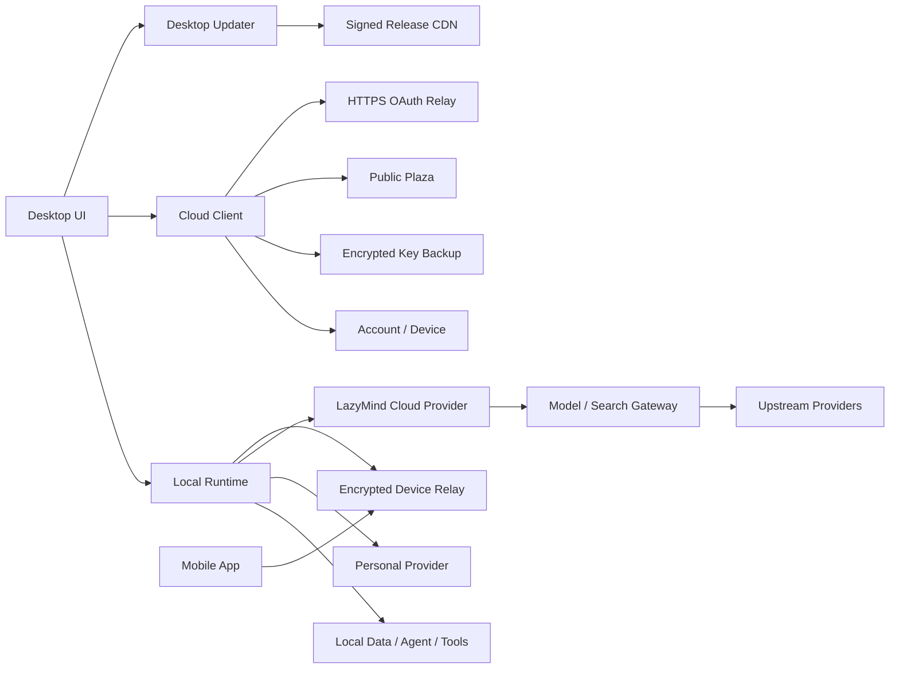

# LazyMind Desktop + Cloud 实施计划

> 状态：实施基线。
> 本文只描述当前产品目标、阶段交付和具体实施工作。后续设计若扩大 Cloud 职责，应先修改本文的产品边界。

## 1. 总体目标和设计思路

### 1.1 产品目标

LazyMind Desktop 是完整产品和执行主体。用户不登录 Cloud，也能使用本地知识库、Chat、Agent、任务、Artifact、Skill、Workflow、本地模型和个人 Provider。

LazyMind Cloud 是 Desktop 的补充服务，只承担以下职责：

1. 公众账号、登录和设备身份；
2. 用户 API Key 及其必要 Provider 配置的加密备份与恢复；
3. 平台模型与检索服务转发；
4. Skill、Workflow 和公共知识包的云广场；
5. 必须依赖公网入口的 HTTPS OAuth 回调中转；
6. Desktop 版本检查、更新包分发和自动更新；
7. 后期为 Mobile App 提供设备发现、配对和端到端加密连接中继。

登录前后，知识库、Agent、任务、聊天历史、本地文件和工具执行位置均不改变：

```text
未登录 Desktop
  -> Local Runtime
  -> 本地数据和本地执行
  -> 本地模型或用户配置的个人 Provider

已登录 Desktop
  -> 同一个 Local Runtime
  -> 自动增加一个平台默认 Provider
  -> 可使用 Key 备份、云广场、HTTPS OAuth Relay 和自动更新
  -> 后期可保持一条到 Cloud 的出站连接，供已配对 Mobile App 访问
```

### 1.2 核心设计

#### Desktop 本地优先

Cloud 不成为 LazyMind Core 的远程替代品。Cloud 登录失败、网络中断或平台额度不足时，Desktop 仍能启动，用户已有的本地数据和个人 Provider 仍然可用。

Cloud Token 与本地管理员 Token 必须分开保存和使用：

- 现有业务请求继续访问 Local Runtime；
- Cloud 请求使用独立的 Cloud Client；
- Cloud Token 不发送给 Local Runtime 以外的个人 Provider 或 MCP 服务；
- 本地管理员 Token 不发送到 Cloud。

#### 平台能力作为默认 Provider 接入

用户登录后，Desktop 在现有 Provider 体系中自动维护一个受系统管理的 `LazyMind Cloud` Provider。该 Provider 包含平台提供的模型目录和检索服务配置，用户不需要填写 Base URL 或 API Key。

平台 Provider 与个人 Provider 使用相同的模型选择、Agent 调用、工具循环、检索编排和流式返回流程。Cloud 只转发单次模型或检索请求，不保存 Agent 状态，也不执行本地工具。每次转发都记录可审计的用量事件，但首期不计算费用、不生成账单。

因此本计划不新增通用 Local Capability Router。若平台接口与现有 Provider 契约存在差异，只在现有模型或检索 Provider 适配边界增加一个平台适配器。

#### API Key 只做端到端加密备份

备份对象是用户创建的第三方 Provider 连接，包括 API Key、Base URL 和恢复该连接所需的最小配置。加密和解密只在 Desktop 完成；Cloud 只保存密文、版本和同步元数据，不能读取明文 API Key。

跨设备恢复使用一份独立于登录密码的随机恢复密钥：

```text
首台设备
  -> 随机生成用户 Vault Master Key
  -> 随机生成高强度 Recovery Key，并只向用户展示一次
  -> 用 Vault Master Key 加密 Provider 配置
  -> 用 Recovery Key 派生的密钥加密 Vault Master Key
  -> Cloud 只保存两类密文

新设备
  -> 用户登录 Cloud 并输入 Recovery Key
  -> 下载并解密 Vault Master Key
  -> 再解密 Provider 配置
  -> 将 Vault Master Key 保存到当前设备系统钥匙串
```

Recovery Key 不上传 Cloud，也不能从账号密码或 Cloud Token 推导。这样 Cloud 即使拥有全部数据库内容也无法解密；新设备则通过用户持有的 Recovery Key 获得解密能力。Recovery Key 丢失且没有任何已授权设备时，只能重置 Vault，旧密文不可恢复，但不会删除任何设备上的本地配置。

第三方 OAuth access token、refresh token 不属于该备份：它们按设备保存在本地，每台设备需要独立授权。

#### 云广场只分发内容，本地负责安装和执行

Cloud 保存公开内容的元数据、版本和签名包。Desktop 下载后复用现有 Skill、Workflow 和知识导入能力完成校验、安装、索引与执行。

“公共知识包”是发布者主动提供的可下载内容，不是用户个人知识库同步，也不允许 Cloud 读取用户本地知识库。

#### HTTPS OAuth Relay 只中转一次性授权结果

支持 loopback callback 的 Provider 继续由 Desktop 本地完成 OAuth。只接受 HTTPS callback 的 Provider 使用 Cloud Relay：Cloud 暂存一次性的 `code` 或错误结果，Desktop 取回后在本地换取并刷新 Token。

Cloud 不保存第三方 access token、refresh token，不代理第三方业务 API。

#### Mobile App 通过 Cloud 连接 Desktop

后期 Mobile App 不直接连接家庭或办公网络中的 Desktop，也不在 Cloud 上创建第二套 Agent。Desktop 登录后主动建立到 Cloud Relay 的出站长连接；App 登录同一 Cloud 账号、完成设备配对后，经 Relay 与指定 Desktop 建立会话：

```text
Mobile App
  -> Cloud Device Relay
  -> 在线 Desktop
  -> Local Runtime
  -> 本地 Chat / Agent / Knowledge / Task
```

App 可以发起和继续对话，也可以查询 Desktop 明确开放的基础信息，例如设备在线状态、运行中的任务、最近会话标题和知识库概览。请求仍由 Local Runtime 执行，Cloud 只负责发现在线设备、校验配对关系和转发密文帧。

配对时 Desktop 生成设备端密钥和一次性二维码，App 与 Desktop 协商端到端会话密钥。消息正文、Agent 流式输出和查询结果在两端加解密，Cloud 只能看到账号、设备、连接状态、流量大小和时间等必要元数据。Desktop 必须在本地维护允许远程访问的能力白名单；文件导出、凭据读取、配置修改和高风险工具默认禁止，后续开放时需要 Desktop 侧确认。

该能力明确有以下限制：

- Desktop 必须在线且 Local Runtime 可用，App 才能对话或查询本地信息；
- Cloud 不持久化聊天正文，也不提供 Desktop 离线时的云端 Agent；
- App 不是 Local Runtime 的公网暴露，所有连接均由两端主动连向 Cloud；
- 撤销设备、退出账号或关闭远程访问后，已有远程会话立即失效。

### 1.3 系统边界




Cloud 明确不提供：

- 用户知识库、原始文件、聊天历史、任务和 Artifact 的云同步；
- 云端 Agent Runtime、工具循环和本地 MCP 代理；
- 企业租户、组织、角色、邀请和分享；
- 文档解析、Milvus、OpenSearch 和 Evo 托管；
- 第三方 OAuth Token 托管；
- Hosted Tool 和复杂的多级能力路由。

Mobile App 远程访问是后期能力，不改变上述非目标：Cloud Relay 可以转发本地工具产生的加密结果，但 Cloud 自身不执行 Agent、工具或 MCP。

首期只实现平台服务所需的最小额度检查、限流和计量，不建设价格、套餐、账单、支付或扣费系统。计量事件是未来计费的输入，但本阶段只用于运营分析、容量规划、异常排查和额度控制。

## 2. 实施阶段总览

阶段按依赖关系顺序实施。Phase 0 冻结契约；Phase 1 建立可信登录和设备身份；之后的 Cloud 能力都基于该身份接入。


| 阶段      | 目标                 | 完成的职责                          | 主要交付物                                         | 阶段验收                               |
| ------- | ------------------ | ------------------------------ | --------------------------------------------- | ---------------------------------- |
| Phase 0 | 冻结边界与契约            | 明确 Desktop/Cloud 分工和复用方式       | API 契约、数据分类、平台 Provider 契约、测试基线               | Mock Cloud 下能验证登录、Provider 和离线降级链路 |
| Phase 1 | 建立云账号基础            | 公众账号、登录、设备身份、独立 Cloud Client   | Account API、设备 API、Desktop 登录入口、安全 Token 存储   | 登录和退出不影响 Local Runtime 与本地数据       |
| Phase 2 | 接入模型与检索转发          | 默认 Provider、模型目录、检索转发、额度、限流和计量 | Gateway、平台 Provider 适配、流式转发、Usage Ledger      | 登录后无需填 Key 即可使用平台能力，且每次调用均可计量      |
| Phase 3 | 完成 API Key 备份      | 客户端加密、备份、恢复和冲突处理               | Vault API、Desktop 加解密与同步、恢复界面                 | Cloud 和日志中均无明文 API Key，新设备可恢复配置    |
| Phase 4 | 完成公网辅助能力           | HTTPS OAuth Relay、版本检查和自动更新    | OAuth 临时事务、更新 Manifest、签名发布链                  | OAuth code 一次性消费；签名更新可安装且失败可安全退出   |
| Phase 5 | 上线云广场              | 内容目录、下载、签名校验、本地安装              | Plaza API、发布流程、Desktop 聚合与安装适配                | 云内容可安装、升级并完全在本地运行                  |
| Phase 6 | 生产化上线              | 部署、监控、限流、审计、容量验证               | 生产部署、告警、Runbook、压测报告                          | 满足安全与容量指标，Cloud 故障不破坏本地能力          |
| Phase 7 | 支持 Mobile App 远程访问 | 设备配对、在线发现、加密中继、远程对话和基础查询       | Device Relay、Desktop Remote Bridge、Mobile SDK | App 可安全连接在线 Desktop，Cloud 无法读取会话正文 |


每个阶段必须独立可发布、可回滚。未完成后续阶段时，已交付能力不得依赖占位接口或临时明文凭据。

## 3. 各阶段具体计划

### Phase 0：边界冻结与契约基线

#### 阶段目标

把本计划转换为可测试的接口和数据边界，消除 Desktop 与 Cloud 团队对“谁保存数据、谁执行逻辑、复用哪条调用链”的分歧。

#### 范围

- 定义公众账号 Token、设备身份和 Cloud API 的认证方式；
- 定义系统管理的 `LazyMind Cloud` Provider 契约；
- 定义模型、检索、Vault、OAuth Relay、Plaza 和 Update 的最小接口；
- 对数据进行“仅本地、Cloud 明文、Cloud 密文、短期临时数据”分类；
- 建立登录、离线和 Cloud 故障的回归基线。

本阶段不实现正式 Cloud 服务，不提前设计支付和企业租户。

#### 现有代码复用

- 以 `backend/core/modelprovider`、`backend/core/modelconfig` 和现有 Model Provider API 作为平台 Provider 契约基线；
- 以现有 Chat、Agent 和 Search 调用链作为不应重写的行为基线；
- 以 `backend/auth-service` 的账号、JWT 和 refresh token 实现作为可提取复用的认证基础；
- 以 `frontend/src/modules/dataSource/oauth` 和现有 Provider OAuth 实现作为 Relay 接入基线；
- 以 `backend/core/skillv2`、现有 `backend/core/plugin` 实现及前端 Skill 包能力作为 Skill/Workflow 广场安装基线；
- 以 `desktop/electron`、构建脚本和 Runtime Manifest 作为更新链基线。

#### 实施步骤

1. 输出一份版本化 OpenAPI 契约，路径统一使用 `/v1`；
2. 固定平台 Provider 的身份、系统管理字段、模型目录格式和删除/覆盖规则；
3. 为模型与检索各选一条现有调用链做契约测试，确认平台适配不会进入 Agent 状态机；
4. 建立数据分类表和日志脱敏规则；
5. 建立 Mock Cloud，用于 Desktop 登录、Token 过期、网关断线和离线启动测试；
6. 记录需要从现有服务提取的共享代码，禁止 Cloud 直接依赖 Core 业务数据库。

#### 交付物

- Cloud OpenAPI 初版；
- 平台 Provider 契约与兼容性测试；
- 数据分类和日志脱敏清单；
- Mock Cloud 与 Desktop 回归测试；
- 服务代码复用清单。

#### 验收标准

- 每类数据都有唯一的保存位置和保留期限；
- 平台模型和检索请求可以通过 Mock Provider 走通现有调用链；
- Cloud 不可用时 Desktop 可启动且本地功能回归通过；
- 契约中不存在知识库、Agent、任务或聊天历史上传接口；
- 后续阶段可以仅依赖本阶段契约开发。

### Phase 1：云账号、设备身份与 Desktop 登录

#### 阶段目标

用户可以在 Desktop 登录 LazyMind Cloud，Desktop 获得用户和设备身份，但登录状态不改变 Local Runtime 的启动和数据归属。

#### 范围

- 个人账号注册、登录、刷新、退出和注销；
- 设备注册、设备列表和设备撤销；
- Desktop 独立 Cloud Client 与安全 Token 存储；
- 登录状态和 Cloud 可用状态的最小 UI。

不迁移现有本地用户，不在公众 UI 暴露租户、角色和用户组。

#### 现有代码复用

- 从 `backend/auth-service` 复用密码哈希、JWT、refresh token 轮换、限流和错误模型；
- 公众 Cloud 使用独立数据库表和迁移，不复用 Core 的租户/RBAC 业务模型；
- Electron 侧复用现有设备身份和凭据派生基础，Cloud refresh token 最终存入系统钥匙串；
- 前端新增 Cloud Auth Store，不替换现有 Local Runtime 会话。

#### 实施步骤

1. 建立独立 Public Account Service 和数据库；
2. 实现 access token 短期有效、refresh token 轮换与重放检测；
3. 首次登录注册 `device_id`，支持查看和撤销设备；
4. Desktop 建立与 Local API Client 分离的 Cloud Client；
5. 在系统钥匙串保存 refresh token，内存中保存短期 access token；
6. 启动时先启动 Local Runtime，再异步恢复 Cloud 会话；
7. 实现退出 Cloud、撤销本设备和注销账号的明确语义。

#### 交付物

- Public Account/Device API 与迁移；
- Desktop 登录、退出和设备管理界面；
- Cloud Client 与 Token 安全存储；
- 登录、刷新、撤销和离线测试。

#### 验收标准

- 未登录和 Cloud 不可用时 Desktop 正常启动；
- 登录、刷新和退出均不重启 Local Runtime；
- 退出 Cloud 不删除本地数据、个人 Provider 和第三方 OAuth 授权；
- 被撤销设备无法刷新 Cloud Token；
- Cloud Token 不出现在 URL、日志和诊断包中，也不会发送给个人 Provider；
- 公众 API 和 UI 不出现企业租户与 RBAC 概念。

### Phase 2：平台模型与检索转发

#### 阶段目标

用户登录后自动获得可用的 `LazyMind Cloud` Provider，并通过现有模型和检索流程使用平台服务。

#### 范围

- 平台模型与检索目录；
- 模型请求和检索请求的流式或普通转发；
- 系统管理的默认 Provider 自动创建、更新和停用；
- 最小额度检查、并发限制、速率限制和逐请求计量；
- 上游超时、断线和错误的稳定映射。

不实现云端 Agent、Hosted Tool、价格计算、账单、支付和跨 Provider 智能路由。

#### 现有代码复用

- 平台模型复用 `backend/core/modelprovider`、`modelconfig`、现有前端 Provider/模型选择页面以及 Chat/Agent 调用链；
- 平台检索复用当前 Search Provider 接口和检索编排，只增加 Cloud Search 适配；
- 平台 Provider 由 Local Runtime 自动维护，凭据由 Cloud 会话动态提供，不把平台长期 Key 写入本地 Provider 表；
- Gateway 只做协议适配、鉴权、限流和转发，不依赖 Core 数据库。

#### 实施步骤

1. 实现带版本与能力标识的模型/检索目录接口；
2. 实现 Gateway 身份校验，并绑定 `user_id`、`device_id` 和请求 ID；
3. 实现首批上游模型适配和流式转发，正确处理客户端取消；
4. 实现首批检索服务适配与统一结果格式；
5. 在 Local Runtime 中增加 `LazyMind Cloud` Provider 适配器；
6. 登录后自动创建或刷新系统 Provider，退出后将其标记为不可用而非删除用户配置；
7. 为每次调用生成唯一 `usage_id`，记录用户、设备、能力、模型、上游、开始/结束时间、状态、输入/输出 Token 或检索次数、延迟和请求关联 ID；
8. 流式模型以最终上游 usage 为准；上游不返回 usage 时使用统一 tokenizer 估算并标记 `estimated=true`；取消和失败请求也落账并记录已产生用量；
9. 增加最小额度、并发和速率限制，额度只控制能否调用，不进行金额换算或扣费；
10. 完成模型流、检索、tool call 透传、计量、断线和降级测试。

#### 交付物

- Model/Search Gateway；
- 模型与检索目录 API；
- Desktop 平台 Provider 适配器与自动维护逻辑；
- 最小额度、限流和 Usage Ledger；
- 端到端与故障注入测试。

#### 验收标准

- 登录后无需填写 Base URL 或 API Key 即可选择平台模型和检索；
- 平台 Provider 使用现有模型选择和 Agent 调用链，不新增 Agent 分支；
- tool call 增量能透传并由 Local Agent 执行工具；
- 客户端取消后 Gateway 及时取消上游请求并结束计量；
- 每次成功、失败或取消的调用都有且只有一条最终计量记录，重试不会重复计量；
- 模型计量至少包含输入/输出 Token，检索计量至少包含请求次数和返回条数，并能区分上游实报与本地估算；
- 计量数据不包含 Prompt、模型响应正文和检索正文，首期不会产生金额、账单或扣费记录；
- 平台额度不足或服务故障时返回稳定错误，个人 Provider 和本地模型不受影响；
- Gateway 不保存 Prompt、模型响应和检索正文；必要运行日志只保留脱敏元数据；
- 平台上游长期凭据只存在于 Cloud Secret 管理系统。

### Phase 3：API Key 加密备份与恢复

#### 阶段目标

用户可以把个人 Provider 配置加密备份到 Cloud，并在新设备登录后恢复；Cloud 无法读取其中的 API Key。

#### 范围

- 第三方 Provider API Key、Base URL 和最小连接配置；
- 客户端加密、版本化同步、恢复、删除和冲突提示；
- 新设备授权和恢复密钥策略；
- 多设备间的增量同步。

不备份平台 Provider、OAuth Token、本地文件、知识库、聊天历史、Agent 和任务。

#### 现有代码复用

- 复用现有 Provider 连接和模型配置的数据结构及导入校验；
- 复用 Desktop 已有模型 Provider 凭据加密基础，但单独建立同步主密钥和密文 Envelope；
- 同步适配层只读写 Provider 服务的公开接口，不直接读写其数据库；
- 恢复后仍由现有 Provider 校验接口验证连接，不在 Cloud 验证明文 Key。

#### 密钥方案

- `Vault Master Key`：每个用户随机生成，用于加密同步对象；只存在于已授权 Desktop 的系统钥匙串中；
- `Recovery Key`：随机生成的高强度恢复码，由用户离线保存，不上传 Cloud；
- `Recovery KEK`：Desktop 使用 Recovery Key、Cloud 保存的随机 salt 和 Argon2id 派生；
- `Wrapped Master Key`：使用 Recovery KEK 通过 AEAD 加密 Vault Master Key 后得到，保存在 Cloud；
- `Vault Object`：每个 Provider 对象使用独立随机 nonce，由 Vault Master Key 通过 AEAD 加密，AAD 包含用户、对象 ID 和 Schema 版本。

账号密码只用于登录，不能解密 Vault。新设备必须输入 Recovery Key；作为后续优化，可以由一个已授权设备扫描二维码批准新设备，但不作为首期依赖。

#### 实施步骤

1. 定义可同步 Provider Schema 和版本迁移规则；
2. 生成 Vault Master Key 和 Recovery Key，将 Recovery Key 只展示一次并要求用户确认已保存；
3. 使用 Argon2id 派生 Recovery KEK，并使用经过审查的 AEAD 算法包装 Vault Master Key；
4. 使用 Vault Master Key 在 Desktop 加密对象，每个对象使用独立随机 nonce 和绑定元数据的 AAD；
5. Vault API 只接收 Wrapped Master Key、salt、密文对象、版本、设备 ID 和更新时间；
6. Desktop 实现上传、本地变更检测、下载、解密和 Schema 校验；
7. 新设备登录后要求输入 Recovery Key，解包 Vault Master Key 并保存到系统钥匙串；
8. 冲突时保留双方版本并提示用户选择，不静默覆盖较新的本地配置；
9. 恢复配置后调用现有 Provider 校验，失败时保留配置但标记不可用；
10. 增加密文篡改、错误恢复码、并发更新、删除传播和 Vault 重置测试。

#### 交付物

- Provider 同步 Schema；
- Desktop Vault 加解密与同步模块；
- Vault API、数据库和清理任务；
- 备份、恢复、冲突与重置 UI；
- 密钥安全和多设备测试。

#### 验收标准

- 抓取 Cloud 请求、数据库、日志和备份均无法得到明文 API Key；
- 密文被修改后 Desktop 拒绝导入；
- 新设备完成身份与密钥恢复后可重建个人 Provider；
- 恢复不会覆盖系统管理的 `LazyMind Cloud` Provider；
- OAuth access token 和 refresh token 不进入 Vault；
- 删除、冲突和同步失败都有可理解且可恢复的状态；
- 重置同步密钥不会删除本地 Provider，旧密文不可再解密。

### Phase 4：HTTPS OAuth Relay 与 Desktop 自动更新

#### 阶段目标

补齐 Desktop 无法独立完成的两项公网职责：接收仅支持 HTTPS 的 OAuth callback，以及安全分发 Desktop 更新。

#### 范围

OAuth Relay：

- 创建短期授权事务；
- 接收 Provider callback；
- 由原用户和原设备一次性取回结果；
- 超时和已消费事务清理。

自动更新：

- macOS 和 Windows 版本检查；
- 签名 Manifest 与安装包分发；
- 灰度、暂停、最低支持版本和回滚；
- 下载、校验、安装和失败恢复。

#### 现有代码复用

- OAuth 页面、Provider 参数、`state` 校验和本地换 Token 流程复用 `backend/auth-service` 与 `frontend/src/modules/dataSource/oauth`；
- 支持 loopback callback 的 Provider 保持现状，不经过 Cloud；
- Relay 只替换 callback 落点，不接管现有 Token 存储、刷新和数据抓取；
- 更新复用 `desktop/electron`、electron-builder、现有 macOS/Windows 构建脚本、安装器和 Runtime Manifest。

#### 实施步骤

1. 为每个需要 Relay 的 Provider登记固定 HTTPS callback；
2. 实现 OAuth transaction 创建接口，绑定用户、设备、Provider 和本地连接 ID，TTL 默认 5 分钟；
3. callback 验证 `state` 后只保存 `code` 或错误，不记录完整请求 URL；
4. Desktop 使用同一设备身份轮询并原子消费结果，再在本地换取 Token；
5. 建立版本 Manifest，包含平台、架构、版本、渠道、下载地址、哈希和签名；
6. 构建产物上传对象存储/CDN，发布元数据通过独立签名密钥签名；
7. Desktop 校验签名和哈希后下载，在安全时机提示或执行安装；
8. 实现灰度比例、暂停发布、最低支持版本和回滚到上一稳定版本；
9. 完成 OAuth 重放/串设备攻击和更新包篡改/断电恢复测试。

#### 交付物

- OAuth Transaction/Callback API 与 Provider 配置；
- Desktop Relay 客户端和本地换 Token 流程；
- Release Manifest、签名工具和发布流水线；
- Desktop 更新检查、下载、校验和安装流程；
- OAuth 与更新安全测试。

#### 验收标准

- OAuth `state` 不可预测、短期有效，并绑定发起用户、设备和 Provider；
- `code` 只能原子消费一次，过期、重放和串设备请求均被拒绝；
- Cloud 不保存 access token、refresh token 和用户第三方 App Secret；
- Relay 故障不影响已有第三方授权和本地数据源；
- Desktop 拒绝签名或哈希不正确的 Manifest 和安装包；
- 更新失败后旧版本仍可启动，本地数据不会被安装器删除；
- 发布可以暂停，问题版本可以停止继续扩散。

### Phase 5：Skill、Workflow 与公共知识云广场

#### 阶段目标

用户可以浏览 Cloud 提供的公共内容，将签名内容包安装到 Desktop，并继续由 Local Runtime 管理和执行。

#### 范围

- Skill、Workflow 和公共知识包目录；
- 内容详情、版本、兼容性和下载；
- 发布者审核、签名、下架和安全撤回；
- 本地内容与 Cloud 内容的聚合、安装和升级。

首期不提供用户私有内容同步、社交关系、在线协作和 Cloud 执行。

#### 现有代码复用

- Skill 复用 `backend/core/skillv2` 的包、版本和本地安装能力；
- Workflow 复用当前 `backend/core/plugin` 模块的校验、版本与本地 Runtime；该代码目录可后续单独迁移命名，不阻塞产品术语更名；
- 前端复用现有 Skill 管理、包预览、差异查看和安装交互；
- 公共知识包下载后进入现有本地导入、解析和索引流程；
- Cloud 目录与本地目录通过稳定内容 ID 和来源字段合并，不改写本地资源模型。

#### 实施步骤

1. 为三类内容定义统一 Manifest：内容 ID、类型、版本、兼容版本、入口、权限声明、文件哈希和签名；
2. 建立发布、自动检查、人工审核、签名和下架流程；
3. 实现 Plaza 列表、详情、版本和短期下载地址接口；
4. Desktop 将本地内置、用户本地和 Cloud 内容聚合展示；
5. 下载后先校验签名、哈希、包路径和兼容性，再交给现有安装流程；
6. 安装前展示权限与文件差异，禁止包静默扩大权限；
7. 实现升级、保留本地修改、卸载和恶意版本撤回；
8. 对路径穿越、压缩炸弹、签名伪造和不兼容版本进行安全测试。

#### 交付物

- 统一内容 Manifest 和签名规范；
- Plaza API、内容存储和发布后台；
- Desktop 广场、内容聚合和安装适配；
- 审核、下架与安全撤回 Runbook；
- 包安全和兼容性测试。

#### 验收标准

- Desktop 只安装签名、哈希和兼容性均验证通过的包；
- 同一内容的本地、内置和 Cloud 版本不会重复展示或误覆盖；
- Skill 与 Workflow 安装后完全由 Local Runtime 执行；
- 公共知识包只在下载到本地后解析和索引；
- Cloud 无法访问用户安装后的内容修改、知识索引和执行数据；
- 已确认恶意的版本可以下架并阻止新安装，已安装用户能收到安全提示。

### Phase 6：生产化、监控与容量验证

#### 阶段目标

将前述服务部署为可运维、可扩容、可审计的生产系统，并验证目标容量下的稳定性和 Desktop 降级行为。

#### 范围

- Cloud 服务容器化与生产部署；
- PostgreSQL、Redis、对象存储、CDN 和 Secret 管理；
- 指标、日志、Trace、告警、审计和数据清理；
- Gateway、Vault、OAuth Relay、Plaza 和 Update 的容量测试；
- 故障演练、备份恢复和发布 Runbook。

#### 现有代码复用

- 复用仓库现有容器、Kong、数据库迁移和服务健康检查方式；
- Auth 的速率限制和 refresh token 存储沿用 Phase 1 已验证组件；
- Gateway 使用 Phase 2 的无状态转发实例横向扩展；
- 静态内容和更新包通过对象存储/CDN 分发，不占用 API 服务连接和带宽；
- Core、Milvus、文档解析和 Evo 不进入 Cloud 部署清单。

#### 实施步骤

1. 为 Account、Gateway、Vault、OAuth、Plaza 和 Release Metadata 分别定义部署与伸缩策略；
2. PostgreSQL 保存账号、设备、Vault 元数据和目录元数据，Redis 保存短期事务、限流和并发状态；
3. Provider Key、签名私钥和数据库凭据进入 Secret 管理系统并支持轮换；
4. 建立按服务、Provider、错误码和延迟维度的指标与告警；
5. 日志默认禁止 Prompt、响应正文、检索正文、API Key、OAuth code 和 Token；
6. 对数据库执行备份恢复，对 Redis 丢失、上游超时和单实例故障执行演练；
7. 验证 2000 名在线 Desktop 用户和 2000 条同时进行的模型/检索流；
8. 验证更新下载走 CDN 后不会挤占 Gateway 容量；
9. 完成分阶段发布、暂停、回滚和事故处理 Runbook。

#### 交付物

- 生产部署配置和环境清单；
- Dashboard、告警、审计与数据保留策略；
- 数据库备份恢复和 Secret 轮换流程；
- 容量、稳定性和故障演练报告；
- 发布、回滚和事故处理 Runbook。

#### 验收标准

- 2000 名在线用户保持 Cloud 会话时，账号和目录接口满足约定 SLO；
- 2000 条并发模型/检索流下，Gateway 无非预期断流，错误率和延迟满足所选上游的基线目标；
- 客户端取消能释放连接、并发额度和上游请求；
- 单个 Gateway 实例、Redis 临时状态或单个上游 Provider 故障不会造成全局不可恢复状态；
- 数据库可从备份恢复，Secret 可在不中断本地能力的情况下轮换；
- 日志抽检不存在被禁止的敏感正文和凭据；
- Cloud 完全不可达时，Desktop 仍可启动并使用本地数据、个人 Provider 和已有本地内容。

### Phase 7：Mobile App 远程访问 Desktop

#### 阶段目标

用户在 Mobile App 登录后可以发现并配对自己的 Desktop，通过 Cloud Relay 在手机上发起对话、接收流式结果，并查询一组安全的基础信息。

#### 范围

- Desktop 在线状态和远程访问开关；
- App 与 Desktop 的一次性配对、设备授权和撤销；
- 双端主动连接 Cloud 的长连接 Relay；
- 端到端加密的命令、响应和流式事件；
- 远程新建/继续对话；
- 设备状态、任务状态、最近会话和知识库概览等只读查询；
- 断线、重连、取消和多 App 会话限制。

不提供 Desktop 离线对话、云端聊天历史、任意 Local API 透传、远程文件系统和默认开放的高风险工具执行。

#### 简单方案

Desktop 首次开启远程访问时生成设备身份密钥，私钥只保存在系统钥匙串，公钥注册到 Cloud。配对流程为：

```text
1. Desktop 向 Cloud 创建一次性 pairing，并显示包含 pairing_id、公钥指纹和 nonce 的二维码
2. App 登录同一账号后扫描二维码并提交自己的临时公钥
3. Desktop 在本地显示 App 信息并由用户确认
4. 两端基于各自密钥协商端到端会话密钥，Cloud 只保存授权关系和公开密钥
5. 后续双方使用短期 session token 连接 Relay，业务帧全部端到端加密
```

可使用成熟的 Noise Protocol 模式或同等级别的经过审查实现完成握手，不自定义密码协议。每个加密帧包含单调递增序号和会话 ID，用于拒绝重放和跨会话注入。

Relay 只理解连接控制帧，不理解业务正文。加密后的业务消息使用版本化 Envelope，内部命令由 Desktop Remote Bridge 映射到少量允许的 Local Runtime API：

- `chat.start`：创建本地对话并流式返回事件；
- `chat.continue`：继续指定的本地对话；
- `chat.cancel`：取消当前生成；
- `device.summary`：查询 Desktop 与 Local Runtime 状态；
- `task.list` / `task.get`：查询任务基本状态；
- `conversation.list`：查询最近会话的 ID、标题和时间；
- `knowledge.summary`：查询知识库名称、文档数和更新时间。

Desktop 不提供任意 URL、SQL 或 Local API passthrough。每个命令都需要独立 Schema、权限和响应字段白名单；移动端收到的本地资源 ID 也不能用于访问未开放接口。

#### 现有代码复用

- 账号和设备身份复用 Phase 1 的 Account/Device API；
- 对话复用现有 Local Runtime Chat/Agent API 与 SSE 事件，只在 Desktop Remote Bridge 转换为加密帧；
- 任务、会话和知识库概览复用现有只读查询服务，但返回字段由远程 DTO 单独收敛；
- 取消和断线行为复用现有 Agent 请求生命周期；
- Cloud Relay 保持独立无状态服务，在线路由和短期 session 状态放入 Redis，不接入 Core 数据库。

#### 实施步骤

1. 定义设备身份、公钥注册、配对、撤销和会话协议；
2. Desktop 增加远程访问开关、设备密钥、出站长连接和配对确认 UI；
3. 实现 Cloud Device Relay、在线状态与单用户连接限制；
4. 实现 Mobile SDK 的登录、扫码配对、密钥存储和 Relay 连接；
5. 实现版本化加密 Envelope、序号校验、重连和密钥轮换；
6. 建立 Desktop Remote Bridge 和首批允许命令；
7. 将本地 SSE Chat 事件转换为 App 可消费的加密流，并支持取消；
8. 增加设备撤销、暴力配对、重放、串账号、Cloud 窃听和恶意命令测试；
9. 对在线 Desktop 数、并发 App 会话、帧吞吐和弱网重连进行容量测试。

#### 交付物

- Remote Device/Session API 与协议文档；
- Cloud Device Relay；
- Desktop Remote Bridge、远程开关与配对界面；
- Mobile App 连接 SDK 和示例界面；
- 端到端加密、安全与弱网测试；
- Relay 监控、限流和运维 Runbook。

#### 验收标准

- 未配对 App 无法连接 Desktop，跨账号设备不可见；
- 配对必须在 Desktop 本地确认，二维码过期或使用一次后失效；
- Cloud 抓包、数据库和日志中不存在聊天正文、Agent 输出和基础查询结果；
- App 能在在线 Desktop 上新建/继续对话、接收流式结果并取消生成；
- App 能查询白名单内的基础信息，不能调用任意 Local API 或读取凭据；
- 撤销 App、关闭远程访问或撤销 Desktop 后，已有 session 和重连凭据立即失效；
- Desktop 离线时 App 明确显示设备离线，不自动转为云端 Agent；
- Relay 中断不影响 Desktop 本地使用，恢复后可以建立新 session。

## 4. Cloud API 清单

以下是当前范围内 Cloud 需要提供的全部 API。这里只冻结 URL 和职责；请求参数、响应结构、错误码和鉴权要求在 Phase 0 的 OpenAPI 中定义。

除 OAuth Provider callback、健康检查和静态下载外，所有接口都必须使用 HTTPS 并验证 LazyMind Cloud 身份。列表中的 `{id}` 均为不可猜测的服务端 ID。

### 4.1 账号与会话


| Method   | URL                                    | 说明                                  |
| -------- | -------------------------------------- | ----------------------------------- |
| `POST`   | `/v1/auth/register`                    | 注册个人 Cloud 账号。                      |
| `POST`   | `/v1/auth/email-verifications`         | 发送或重发邮箱验证消息。                        |
| `POST`   | `/v1/auth/email-verifications/confirm` | 使用一次性凭据完成邮箱验证。                      |
| `POST`   | `/v1/auth/login`                       | 登录并签发 access token 与 refresh token。 |
| `POST`   | `/v1/auth/refresh`                     | 轮换 refresh token 并签发新的会话。           |
| `POST`   | `/v1/auth/logout`                      | 撤销当前 refresh token。                 |
| `POST`   | `/v1/auth/password-resets`             | 发起密码重置并发送一次性凭据。                     |
| `POST`   | `/v1/auth/password-resets/confirm`     | 使用一次性凭据设置新密码并撤销旧会话。                 |
| `GET`    | `/v1/account`                          | 获取当前账号的基本信息与状态。                     |
| `PATCH`  | `/v1/account`                          | 修改当前账号允许编辑的基本信息。                    |
| `PUT`    | `/v1/account/password`                 | 验证旧密码后修改当前账号密码。                     |
| `DELETE` | `/v1/account`                          | 注销当前 Cloud 账号并启动数据清理流程。             |


### 4.2 设备


| Method   | URL                       | 说明                       |
| -------- | ------------------------- | ------------------------ |
| `POST`   | `/v1/devices`             | 注册当前 Desktop 设备或刷新其公开信息。 |
| `GET`    | `/v1/devices`             | 列出当前账号的设备和最后活动时间。        |
| `GET`    | `/v1/devices/{device_id}` | 获取单个设备状态。                |
| `DELETE` | `/v1/devices/{device_id}` | 撤销设备及其 Cloud 会话。         |


### 4.3 平台 Provider 与能力目录


| Method | URL                      | 说明                                                       |
| ------ | ------------------------ | -------------------------------------------------------- |
| `GET`  | `/v1/provider/bootstrap` | 返回 Desktop 自动维护 `LazyMind Cloud` Provider 所需的版本、端点和默认配置。 |
| `GET`  | `/v1/models`             | 返回当前账号可使用的模型、能力和上下文限制。                                   |
| `GET`  | `/v1/search/services`    | 返回当前账号可使用的检索服务及能力。                                       |
| `GET`  | `/v1/quota`              | 返回模型与检索能力的当前额度和并发限制；不包含价格。                               |


### 4.4 模型与检索 Gateway

模型接口优先兼容现有 Provider 所需协议；如现有调用链采用 OpenAI 兼容协议，应保持请求和流式响应兼容。


| Method | URL                        | 说明                                       |
| ------ | -------------------------- | ---------------------------------------- |
| `POST` | `/v1/chat/completions`     | 转发 LLM/VLM Chat 请求，支持流式响应和 tool call 透传。 |
| `POST` | `/v1/embeddings`           | 转发文本或多模态 Embedding 请求。                   |
| `POST` | `/v1/rerank`               | 转发 Reranker 请求。                          |
| `POST` | `/v1/images/generations`   | 转发图像生成请求；仅在目录声明支持时开放。                    |
| `POST` | `/v1/images/edits`         | 转发图像编辑请求；仅在目录声明支持时开放。                    |
| `POST` | `/v1/audio/transcriptions` | 转发语音识别请求；仅在目录声明支持时开放。                    |
| `POST` | `/v1/audio/speech`         | 转发语音合成请求；仅在目录声明支持时开放。                    |
| `POST` | `/v1/search/web`           | 执行平台 Web Search 并返回统一检索结果。               |
| `POST` | `/v1/search/papers`        | 执行平台 Paper Search 并返回统一检索结果。             |


目录未声明的能力不得仅因为 URL 存在就被 Desktop 展示。首期可以只上线其中一部分，但已上线能力必须使用上述稳定 URL。

### 4.5 计量


| Method | URL                            | 说明                        |
| ------ | ------------------------------ | ------------------------- |
| `GET`  | `/v1/usage/summary`            | 按时间和能力返回当前用户的聚合用量，不计算金额。  |
| `GET`  | `/v1/usage/records`            | 分页返回当前用户的逐请求计量记录和实报/估算标记。 |
| `GET`  | `/v1/usage/records/{usage_id}` | 返回单次模型或检索调用的计量详情。         |


用量由 Gateway 服务端落账，Desktop 不提交可信用量，因此不提供面向 Desktop 的用量写入接口。

### 4.6 Vault


| Method   | URL                             | 说明                                          |
| -------- | ------------------------------- | ------------------------------------------- |
| `GET`    | `/v1/vault`                     | 获取 Vault 状态、Schema 版本和最新同步游标。               |
| `PUT`    | `/v1/vault/key-envelope`        | 创建或替换 Wrapped Master Key、KDF 参数和 salt。      |
| `GET`    | `/v1/vault/key-envelope`        | 获取新设备恢复所需的 Wrapped Master Key、KDF 参数和 salt。 |
| `GET`    | `/v1/vault/objects`             | 按游标增量列出密文对象及墓碑记录。                           |
| `GET`    | `/v1/vault/objects/{object_id}` | 获取单个密文对象及版本信息。                              |
| `PUT`    | `/v1/vault/objects/{object_id}` | 按期望版本创建或更新一个密文对象。                           |
| `DELETE` | `/v1/vault/objects/{object_id}` | 创建删除墓碑并传播到其他设备。                             |
| `DELETE` | `/v1/vault`                     | 重置 Cloud Vault；不删除任何设备上的本地 Provider。        |


Vault API 不接受恢复码、Vault Master Key、明文 API Key 或可逆的账号密码派生物。

### 4.7 HTTPS OAuth Relay


| Method   | URL                                              | 说明                                |
| -------- | ------------------------------------------------ | --------------------------------- |
| `POST`   | `/v1/oauth/transactions`                         | 创建绑定用户、设备、Provider 和本地连接的一次性授权事务。 |
| `GET`    | `/v1/oauth/transactions/{transaction_id}`        | 查询事务是否待处理、成功、失败或过期。               |
| `DELETE` | `/v1/oauth/transactions/{transaction_id}`        | 取消尚未完成的授权事务。                      |
| `GET`    | `/v1/oauth/transactions/{transaction_id}/result` | 原子消费一次 OAuth code 或错误结果。          |
| `GET`    | `/v1/oauth/callback/{provider}`                  | 接收第三方 Provider 的 HTTPS callback。  |


结果接口成功返回后立即删除 code；事务过期清理也必须删除尚未消费的 code。

### 4.8 云广场

`content_type` 首期只允许 `skill`、`workflow` 和 `knowledge`。


| Method | URL                                                           | 说明                         |
| ------ | ------------------------------------------------------------- | -------------------------- |
| `GET`  | `/v1/plaza/contents`                                          | 分页查询内容，可按类型、标签、兼容版本和关键词筛选。 |
| `GET`  | `/v1/plaza/contents/{content_id}`                             | 获取内容详情、权限声明和当前稳定版本。        |
| `GET`  | `/v1/plaza/contents/{content_id}/versions`                    | 列出内容的可用版本和兼容性。             |
| `GET`  | `/v1/plaza/contents/{content_id}/versions/{version}`          | 获取指定版本 Manifest、哈希和签名。     |
| `POST` | `/v1/plaza/contents/{content_id}/versions/{version}/download` | 签发短期下载地址并记录匿名化下载计数。        |


安装、升级和卸载是 Local Runtime 行为，因此 Cloud 不提供 `/install` 或 `/execute` 接口。

### 4.9 Desktop 更新


| Method | URL                                  | 说明                                      |
| ------ | ------------------------------------ | --------------------------------------- |
| `GET`  | `/v1/releases/latest`                | 按平台、架构、当前版本和渠道返回适用的签名 Release Manifest。 |
| `GET`  | `/v1/releases/{release_id}`          | 获取指定发布的状态、版本和签名 Manifest。               |
| `POST` | `/v1/releases/{release_id}/download` | 签发更新包的短期 CDN 下载地址。                      |


更新包本体从对象存储/CDN 下载，不由 API 服务代理大文件流量。

### 4.10 运营与发布接口

以下接口只面向 Cloud 运营后台或 CI，使用独立管理员身份和审计策略，不接受普通 Desktop Token。


| Method | URL                                                                 | 说明                          |
| ------ | ------------------------------------------------------------------- | --------------------------- |
| `POST` | `/v1/admin/plaza/contents`                                          | 创建广场内容草稿。                   |
| `PUT`  | `/v1/admin/plaza/contents/{content_id}`                             | 更新内容元数据和审核状态。               |
| `POST` | `/v1/admin/plaza/contents/{content_id}/versions`                    | 上传待审核内容包并触发自动检查。            |
| `POST` | `/v1/admin/plaza/contents/{content_id}/versions/{version}/publish`  | 签名并发布审核通过的版本。               |
| `POST` | `/v1/admin/plaza/contents/{content_id}/versions/{version}/withdraw` | 下架指定版本并发布安全状态。              |
| `POST` | `/v1/admin/releases`                                                | 由发布流水线登记新的 Desktop Release。 |
| `PUT`  | `/v1/admin/releases/{release_id}`                                   | 修改灰度比例、最低版本和发布说明。           |
| `POST` | `/v1/admin/releases/{release_id}/publish`                           | 发布或继续灰度指定 Release。          |
| `POST` | `/v1/admin/releases/{release_id}/pause`                             | 暂停指定 Release 的继续分发。         |
| `POST` | `/v1/admin/releases/{release_id}/rollback`                          | 将渠道回滚到上一稳定 Release。         |


### 4.11 内部运维接口


| Method | URL        | 说明                      |
| ------ | ---------- | ----------------------- |
| `GET`  | `/healthz` | 进程存活检查，不探测下游依赖。         |
| `GET`  | `/readyz`  | 就绪检查，验证当前实例处理请求所需的关键依赖。 |
| `GET`  | `/metrics` | 暴露内部监控指标，只允许监控网络访问。     |


## 5. 完成定义

全部阶段完成后，产品应满足以下最终状态：

- Desktop 始终是完整 LazyMind Runtime 和用户数据的唯一执行主体；
- 登录 Cloud 后，用户自动获得一个复用现有调用链的平台 Provider；
- 用户可以端到端加密备份和恢复个人 Provider API Key；
- 仅支持 HTTPS callback 的 OAuth Provider 可以完成授权，但 Token 始终留在本地设备；
- 每次平台模型与检索调用均形成不含请求正文的计量记录，但不产生费用和账单；
- 用户可以从云广场下载经签名的 Skill、Workflow 和公共知识包，并在本地安装和执行；
- Desktop 可以验证并安装签名更新；
- Cloud 故障只使 Cloud 增量能力不可用，不破坏用户已有的本地工作环境。

不满足以上任一边界的新增需求，不直接并入实施阶段，应先作为产品范围变更重新评审。